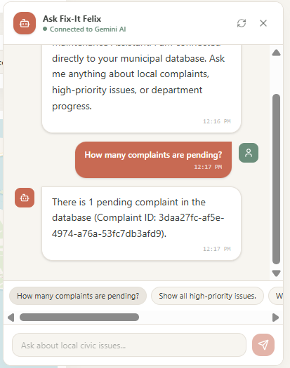
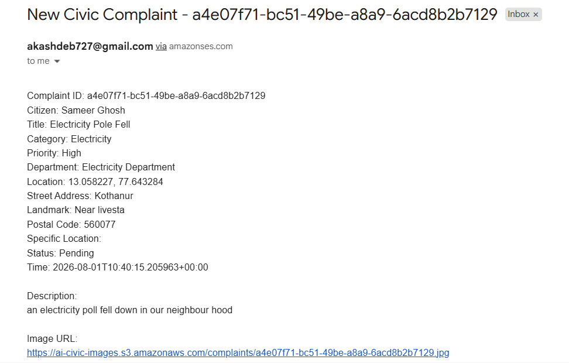

# 🛠️ Fix-It Felix

> **An AI-powered civic issue reporting platform that enables citizens to report infrastructure issues while helping municipal authorities prioritize and resolve them efficiently using Google Gemini AI and AWS Serverless services.**

---

## 🌐 Live Demo

🔗 **Website:** [http://ai-civic-frontend.s3-website.ap-south-1.amazonaws.com](http://ai-civic-frontend.s3-website.ap-south-1.amazonaws.com)

---

## 📖 Overview

**Fix-It Felix** is a serverless AI-powered civic issue reporting platform that bridges the communication gap between citizens and municipal authorities.

Citizens can report infrastructure problems such as **potholes, broken streetlights, garbage dumps, water leakage, fallen trees, road damage, and other public infrastructure issues** by uploading an image and selecting the issue location.

The platform uses **Google Gemini AI** to automatically categorize the complaint, assess its severity, and generate a detailed complaint description. The resulting complaints are stored in AWS and made available through an administrative dashboard for efficient prioritization and management.

When a new complaint is submitted, **Amazon SES** automatically sends a complaint notification email to the administrator/municipal authority.

---

## ✨ Features

### 👥 Citizen Portal

- 📸 Upload complaint images
- 📍 Select complaint location using an interactive map
- 🤖 AI-powered complaint processing using Google Gemini
- 🧠 Automatic issue categorization
- 📝 AI-generated complaint description
- 🚨 AI-based severity assessment
- 📤 One-click complaint submission

### 🏛️ Admin Dashboard

- 📊 Complaint statistics
- 🗺️ Interactive complaint map
- 📌 Complaint location visualization
- 📷 View uploaded complaint images
- 🔄 Update complaint status
- 📈 Track Pending, In Progress, and Resolved complaints
- 📧 Receive email notifications for newly submitted complaints

### 🤖 AI Capabilities

- Automatic complaint classification using Google Gemini
- AI-powered severity assessment
- AI-generated complaint/report descriptions
- AI-powered chatbot for civic issue assistance

### 📧 Notifications

- Automatic complaint notification emails using **Amazon SES**
- Sends newly submitted complaint details to the administrator/municipal authority

---

# 🏗️ Architecture

The application follows a **serverless AWS architecture**, with Google Gemini providing AI-powered complaint processing and chatbot capabilities.

### Architecture Flow

    Citizen
       │
       ▼
    React + TypeScript Frontend
       │
       │ Hosted on Amazon S3
       ▼
    Amazon API Gateway
       │
       ▼
    AWS Lambda
       │
       ├── Google Gemini AI
       │
       ├── Amazon DynamoDB
       │
       ├── Amazon S3
       │
       └── Amazon SES
              │
              ▼
       Administrator / Municipal Authority
              │
              ▼
          Complaint Email

### Complaint Submission Flow

    Citizen
       │
       ▼
    POST /submit
       │
       ▼
    submitComplaint Lambda
       │
       ├──► Google Gemini API
       │       ├── Classification
       │       ├── Severity Assessment
       │       └── Description Generation
       │
       ├──► Amazon S3
       │       └── Complaint Image
       │
       ├──► Amazon DynamoDB
       │       └── Complaint Metadata
       │
       └──► Amazon SES
               │
               ▼
          Administrator
          Complaint Email

---

# 🤖 Google Gemini AI

Google Gemini is integrated into multiple parts of the application.

### Complaint Processing

When a citizen submits an issue:

    Complaint Information
              │
              ▼
       submitComplaint Lambda
              │
              ▼
        Google Gemini API
              │
              ▼
     ┌─────────────────────────┐
     │ Issue Classification    │
     │ Severity Assessment     │
     │ Description Generation  │
     └─────────────────────────┘
              │
              ▼
          DynamoDB

### AI Chatbot

Gemini also powers the application's chatbot functionality through the `chatbotQuery` Lambda, allowing users to interact with the system and receive AI-generated responses based on civic complaint data.

---

# 📧 Amazon SES

**Amazon Simple Email Service (SES)** is used to notify the administrator whenever a new civic complaint is submitted.

    Citizen Complaint
           │
           ▼
    submitComplaint Lambda
           │
           ▼
       Amazon SES
           │
           ▼
    Administrator Email

The notification email contains important complaint information such as:

- Complaint ID
- Citizen name
- Issue title
- Category
- Priority
- Department
- Location
- Description
- Complaint image URL

This allows the administrator to receive complaint details immediately when a new issue is reported.

---

# ☁️ AWS Services Used

| AWS Service | Purpose |
|---|---|
| **Amazon S3** | Hosts the frontend and stores complaint images |
| **AWS Lambda** | Runs serverless backend logic |
| **Amazon API Gateway** | Provides REST API endpoints |
| **Amazon DynamoDB** | Stores complaint metadata and application data |
| **Amazon SES** | Sends complaint notification emails to administrators |
| **IAM** | Manages permissions and access between AWS services |

---

# 🖥️ Application Screenshots

## 🏠 Citizen Home

---

## 📝 Report an Issue

### Top Section

### Bottom Section

---

## 🏛️ Admin Dashboard

---

## 🤖 AI Chatbot

---

## 📧 Complaint Notification Email

---

# ☁️ AWS Infrastructure

The following screenshots show the AWS infrastructure used to deploy and operate the application.

### AWS Lambda

### Amazon API Gateway

### Amazon DynamoDB

### Amazon S3

> Amazon SES is used for complaint email notifications. The resulting notification email is demonstrated in the **Complaint Notification Email** screenshot above.

---

# 🛠️ Tech Stack

### Frontend

- React
- TypeScript
- Vite
- Tailwind CSS
- Leaflet

### Backend

- AWS Lambda
- Amazon API Gateway
- Amazon DynamoDB
- Amazon S3
- Amazon SES
- IAM

### AI

- Google Gemini API

---

# 📁 Project Structure

    fix-it-felix/
    │
    ├── architecture/
    │   └── architecture-diagram.png
    │
    ├── frontend/
    │   ├── src/
    │   ├── assets/
    │   ├── package.json
    │   └── ...
    │
    ├── lambda/
    │   ├── chatbotQuery.py
    │   ├── dashboardStats.py
    │   ├── getComplaints.py
    │   ├── submitComplaint.py
    │   └── updateStatus.py
    │
    ├── screenshots/
    │   ├── aws/
    │   │   ├── api-gateway.png
    │   │   ├── dynamodb.png
    │   │   ├── lambda-functions.png
    │   │   └── s3.png
    │   │
    │   └── frontend/
    │       ├── admin-dashboard.png
    │       ├── chatbot.png
    │       ├── complaint-email.png
    │       ├── home.png
    │       ├── report-issue-bottom.png
    │       └── report-issue-top.png
    │
    └── README.md

---

# 🚀 Getting Started

### Clone the repository

    git clone https://github.com/AkashDeb727/fix-it-felix.git
    cd fix-it-felix

### Run the frontend locally

    cd frontend
    npm install
    npm run dev

The frontend will be available at the local development URL provided by Vite.

> Backend AWS resources are already deployed for the live demo. Running the frontend locally requires the appropriate API configuration in `.env`.

---

# 🔮 Future Enhancements

- 📱 Mobile application
- 🔔 Real-time status update notifications
- 🌍 Multilingual support
- 🤖 AI-based duplicate complaint detection
- 📊 Predictive hotspot analysis
- 🛰️ Satellite imagery integration
- 📈 Advanced analytics for municipal authorities

---

# 👥 Team

**Project:** **Fix-It Felix**

Developed during the **MLH Hackathon**.

### 👨‍💻 Akash Deb

- Designed and implemented the serverless AWS architecture
- Developed backend services using **AWS Lambda, API Gateway, DynamoDB, S3, SES, and IAM**
- Integrated **Google Gemini AI** for complaint processing
- Implemented AI-powered issue categorization, severity assessment, and description generation
- Developed backend APIs for complaint submission, retrieval, dashboard statistics, and status management
- Implemented **Amazon SES email notifications** for newly submitted complaints
- Implemented the AI chatbot backend using Gemini
- Configured and deployed AWS infrastructure
- Integrated the backend with the frontend

### 👨‍💻 Sameer Ghosh

- Developed the frontend using **React, TypeScript, Vite, and Tailwind CSS**
- Built the **Citizen Portal** and **Admin Dashboard**
- Implemented the interactive map using **Leaflet**
- Designed the UI/UX and responsive layouts
- Integrated the frontend with backend APIs

---

## ⭐ Support

If you found **Fix-It Felix** interesting, consider giving the repository a ⭐ on GitHub!
